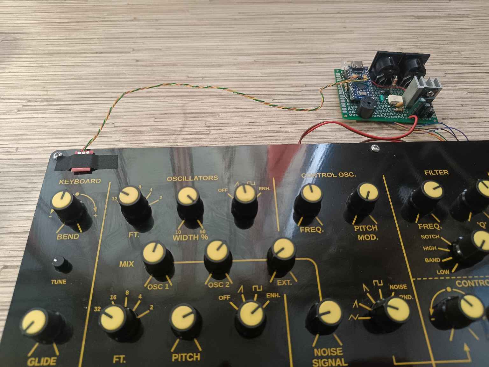
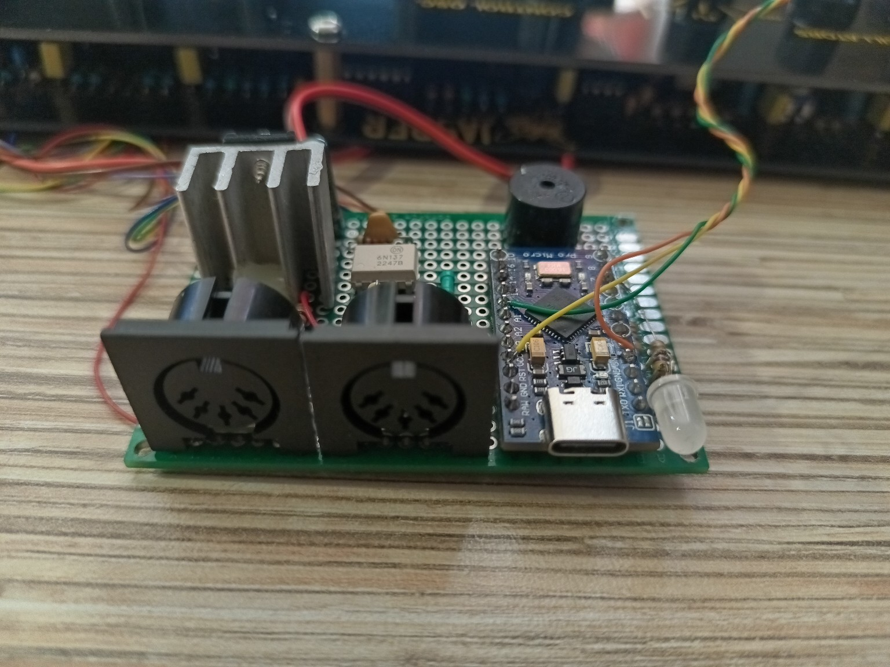

# Jasper / Wasp MIDI Sequencer

A compact MIDI interface, clock utility, arpeggiator and monophonic sequencer for the **Jasper** synthesizer / **EDP Wasp** architecture, built around an **Arduino Pro Micro (ATmega32U4, 5 V / 16 MHz)**.

The project talks directly to Jasper's **LINK** interface and adds modern MIDI control without modifying the original synthesizer circuitry.



*Working prototype connected to a Jasper Rev 2.2 synthesizer.*

## Features

- USB MIDI input
- 5-pin DIN MIDI input
- DIN MIDI OUT / software THRU
- USB MIDI -> DIN MIDI conversion
- Direct Jasper LINK control
- Last-note priority
- Internal MIDI clock
- External MIDI Clock (24 PPQN)
- MIDI Start / Continue / Stop support
- Clock source indication
- Step sequencer
- Live recording
- Free-start live recording
- 1, 2 or 4 bar patterns
- 1/4, 1/8 and 1/16 note resolution
- Arpeggiator
- EEPROM storage for settings and sequence data
- Hidden configuration interface using the Jasper keyboard
- No display required
- Fail-open LINK handling: MCU pins return to high impedance when not actively driving the synth

## Compatibility

This project was developed and tested with a **Jasper Rev 2.2** synthesizer, a clone / recreation of the **Electronic Dream Plant (EDP) Wasp**.

The LINK interface uses 5 V TTL-level signals. The firmware is based on measurements of the Jasper keyboard protocol and on the known Wasp/Jasper LINK note encoding.

> **Important:** MIDI note 36 is intentionally ignored because the lowest C has a hardware limitation in the original Wasp/Jasper LINK decoding scheme.

## Hardware

Main controller:

- Arduino Pro Micro, ATmega32U4, 5 V / 16 MHz

Additional parts:

- 6N137 high-speed optocoupler for DIN MIDI IN
- 5-pin DIN connectors for MIDI IN and MIDI OUT
- 10 kΩ series resistors on Jasper LINK lines
- passive piezo buzzer
- SET button or touch sensor
- two clock-indicator LED channels
- optional regulated 5 V supply

See [docs/wiring.md](docs/wiring.md) for the current wiring.

### Prototype interface board



*Current hand-built prototype with Arduino Pro Micro, DIN MIDI IN/OUT, 6N137 input stage, local 5 V regulation, clock indication and buzzer.*

## Jasper LINK pin assignment

| Pro Micro | Jasper LINK | Function |
|---|---|---|
| D2 | T | keyboard frame / trigger |
| D3 | A | note data |
| D4 | B | note data |
| D5 | C | note data |
| D6 | D | note data |
| D7 | E | octave/data |
| D8 | F | octave/data |
| GND | GND | common ground |

All LINK signal lines are connected through approximately **10 kΩ series resistors**.

## Other I/O

| Pro Micro pin | Function |
|---|---|
| D0 / RX1 | DIN MIDI IN from 6N137 |
| D1 / TX1 | DIN MIDI OUT / software THRU |
| D9 | internal-clock LED |
| D16 | external-clock LED |
| D10 | passive piezo buzzer |
| A0 | SET input |
| A1 | unused analog input, currently used only as a random-seed source |

## MIDI routing

```text
DIN MIDI IN ───────┬────> Jasper LINK
                   └────> DIN MIDI OUT / THRU

USB MIDI IN ───────┬────> Jasper LINK
                   └────> DIN MIDI OUT
```

DIN input bytes are forwarded directly to the hardware MIDI output. USB-MIDI packets are converted back to a standard 31.25 kbaud MIDI byte stream and transmitted on D1/TX1.

## Clock and transport

The firmware supports:

- internal clock: 30–300 BPM
- external MIDI Clock: `0xF8`, 24 PPQN
- Start: `0xFA`
- Continue: `0xFB`
- Stop: `0xFC`

D9 flashes on quarter notes when the internal clock is active.  
D16 flashes on quarter notes when valid external MIDI Clock is being received.

If external MIDI Clock disappears, the firmware automatically falls back to the internal clock.

## Sequencer

Maximum storage: **64 steps**.

| Bars | 1/4 | 1/8 | 1/16 |
|---:|---:|---:|---:|
| 1 | 4 | 8 | 16 |
| 2 | 8 | 16 | 32 |
| 4 | 16 | 32 | 64 |

### Step Record

Enter with:

`SET -> G#1`

After Step Record has been selected, **SET can be released**. The mode remains active until all required steps have been entered.

- play a key briefly: record that note
- hold C3 for at least 700 ms: record a rest
- after the final step the pattern is saved automatically
- press SET during an unfinished Step Record session to cancel it; the previously saved sequence remains unchanged

### Live Record

Enter with:

`SET -> A#1`

Normal mode gives one bar of count-in, records the configured pattern length, saves automatically, and immediately starts playback.

Free-start mode removes the count-in and waits for the first played note. That first note defines the loop start.

The first input source used for a Live Record take wins: Jasper keyboard or external MIDI.

## Arpeggiator

The arpeggiator supports:

- Up
- Down
- Up/Down
- Down/Up
- Order
- Random

Available rates:

- 1/4
- 1/8
- 1/16

## Hidden keyboard configuration

Hold **SET** and use the Jasper keyboard as the configuration panel.

| Key | Function |
|---|---|
| C#1 | MIDI setup |
| D#1 | Tempo |
| F#1 | Sequencer setup |
| G#1 | Step Record |
| A#1 | Live Record |
| C#2 | Arpeggiator setup |
| C3 | Play saved sequence |

White-key numeric mapping:

| Key | Digit |
|---|---:|
| C1 | 0 |
| D1 | 1 |
| E1 | 2 |
| F1 | 3 |
| G1 | 4 |
| A1 | 5 |
| B1 | 6 |
| C2 | 7 |
| D2 | 8 |
| E2 | 9 |

See [docs/controls.md](docs/controls.md) for the complete control reference.

## Firmware

The Arduino sketch is in:

`firmware/jasper_wasp_midi.ino`

Required Arduino library:

- **MIDIUSB**

The code targets an Arduino-compatible ATmega32U4 board such as the 5 V / 16 MHz Pro Micro.

## Design notes

The original Wasp/Jasper keyboard and an external LINK driver cannot safely control LINK at the same time. The firmware therefore switches the LINK pins between OUTPUT and high-impedance INPUT modes depending on what the interface is doing.

Fast envelope retriggering is also limited by the original Wasp/Jasper behavior. The sequencer intentionally leaves a short gap between successive notes to improve envelope retrigger reliability.

## Project status

The firmware is functional and currently in real-hardware testing. The core feature set is considered complete; current work is focused on testing, reliability and documentation rather than adding features.

## Search keywords

EDP Wasp, Electronic Dream Plant Wasp, Jasper Synthesizer, Jasper Wasp, Jasper Rev 2.2, Wasp LINK, Jasper LINK, Arduino MIDI, Pro Micro MIDI, ATmega32U4 MIDI, Wasp MIDI interface, Jasper MIDI sequencer.

## License

This project is released under the MIT License. See [LICENSE](LICENSE) for details.

## Disclaimer

This is an independent DIY project and is not affiliated with Electronic Dream Plant, Jasper Electronics, or the designers of the Jasper synthesizer. Hardware modifications and connections are made at your own risk.
